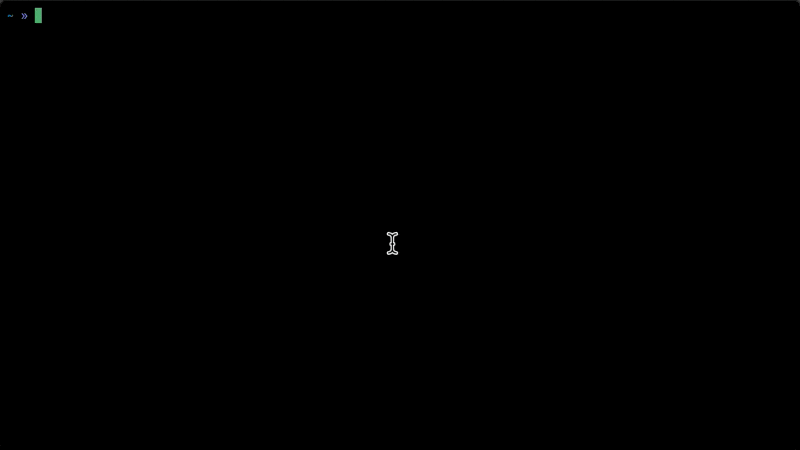

# AWS SSH

Cli tool for connection to EC2 through session manager.

It's a wrapper TUI around AWS CLI tool, designed to simplify the process of connecting to your EC2 instances.

This tool leverages the AWS CLI and SSM plugin to provide a user-friendly interface for selecting and connecting to EC2 instances.



### Before installing this tool:
> This tool requires you to install AWS CLI tool and SSM plugin. Also make sure aws cli and ssm plugin are in your PATH.
> You can check if they are installed by running the following commands:

```bash
aws --version
session-manager-plugin --version
```
For installing, you may follow the link below:

[Installing the AWS CLI](https://docs.aws.amazon.com/cli/latest/userguide/cli-chap-install.html)

[Installing the AWS SSM Plugin](https://docs.aws.amazon.com/systems-manager/latest/userguide/session-manager-working-with-install-plugin.html)

### Installation

You can download the latest release from the [releases page](https://github.com/semiherdogan/aws-ssh/releases).

### Usage

```bash
aws-ssh [--profile|-p] [--region|-r] searchparam1 searchparam2 ...
```

This will launch a UI that lists all your EC2 instances. You can search and select the instance you wish to connect to. The tool will then initiate a connection using the AWS Session Manager.

### Features
* Easy to use TUI for selecting EC2 instances
* Search functionality to quickly find your instances
* Connects to EC2 through AWS Session Manager for secure access

### Region Configuration
Add regions key into sections in your `.aws/credentials` file to specify the regions you want to auto connect to (comma separated).
If this key given in the configuration file, this tool automatically searches for instances in the specified regions.
If you don't specify any regions, the tool will ask you to select a region when you run it.
Example:
```
[default]
aws_access_key_id = YOUR_ACCESS_KEY
aws_secret_access_key = YOUR_SECRET_KEY
regions = us-east-1,us-west-2
```

### Contributing
Contributions are welcome! Please feel free to submit a pull request.

### License
This project is licensed under the MIT License - see the [LICENSE](LICENSE) file for details.
